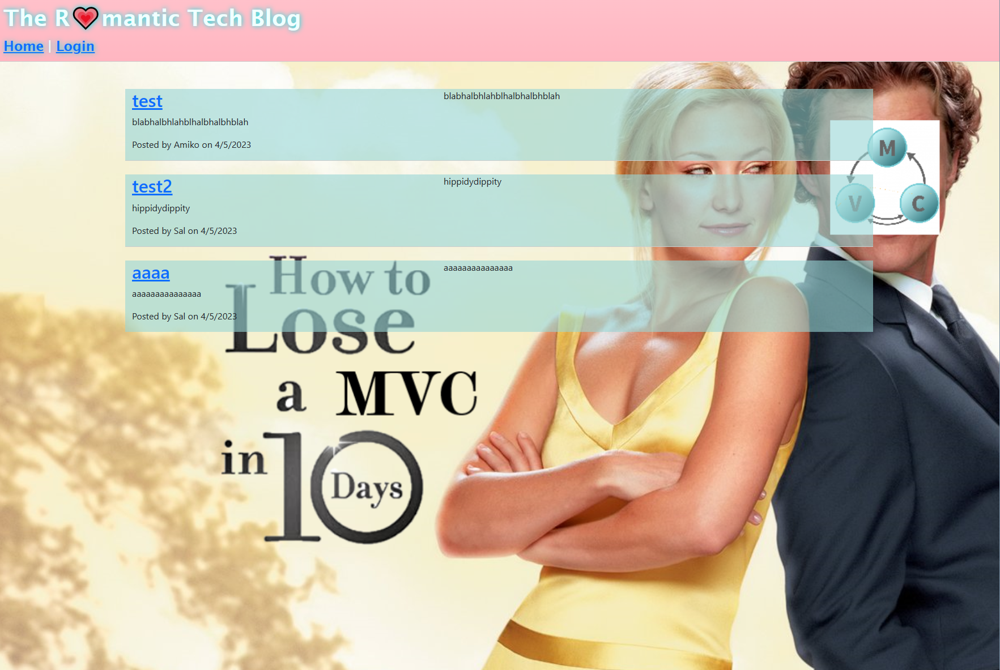

# how-to-lose-a-mvc-in-10-days
  [](https://opensource.org/licenses/MIT)


  A classic romantic comedy blog for some tech bologna, starring you and the mvc you accidentally fall in love with.
  ## Table of Contents:
  * [Installation](#installation)
  * [Usage](#usage)
  * [License](#license)
  * [Contributing](#contributing)
  * [Tests](#tests)
  * [Questions](#questions)
  ## Installation:
  To install the dependencies needed, open the console and run:
  npm i
  ## Usage:
  If you are just visiting the site, you must log in or create an account to be able to post on the blog or to add a comment. If you are running it from the command prompt, you must npm run seed, then npm start, and then visit localhost:3001/
  
  ```md
  Homepage view
  ```

  
  
  ```md
  Login/Signup
  ```
  
  
  ```md
  Dashboard view, also where you can post a new blog post
  ```

  
  
  ```md
  Blog post is added to current list of blog posts from that user
  ```

  
  
  ```md
  Blog is also now added to home
  ```

  
  
  ```md
  This would be where you could ideally comment on the blog post (you can't, I didn't get it working in time)
  ```

  
  
  ## License:
  The MIT License (MIT)

      Copyright (c) undefined undefined
      
      Permission is hereby granted, free of charge, to any person obtaining a copy of this software and associated documentation files (the "Software"), to deal in the Software without restriction, including without limitation the rights to use, copy, modify, merge, publish, distribute, sublicense, and/or sell copies of the Software, and to permit persons to whom the Software is furnished to do so, subject to the following conditions:
      
      The above copyright notice and this permission notice shall be included in all copies or substantial portions of the Software.
      
      THE SOFTWARE IS PROVIDED "AS IS", WITHOUT WARRANTY OF ANY KIND, EXPRESS OR IMPLIED, INCLUDING BUT NOT LIMITED TO THE WARRANTIES OF MERCHANTABILITY, FITNESS FOR A PARTICULAR PURPOSE AND NONINFRINGEMENT. IN NO EVENT SHALL THE AUTHORS OR COPYRIGHT HOLDERS BE LIABLE FOR ANY CLAIM, DAMAGES OR OTHER LIABILITY, WHETHER IN AN ACTION OF CONTRACT, TORT OR OTHERWISE, ARISING FROM, OUT OF OR IN CONNECTION WITH THE SOFTWARE OR THE USE OR OTHER DEALINGS IN THE SOFTWARE.
  ## Contributing:
  N/A
  ## Tests:
  N/A
  ## Questions:
  If you have questions, you may contact me on [GitHub](https://github.com/d-lil) or you may reach out by contacting Daniel Liljegren at dahneel@gmail.com
